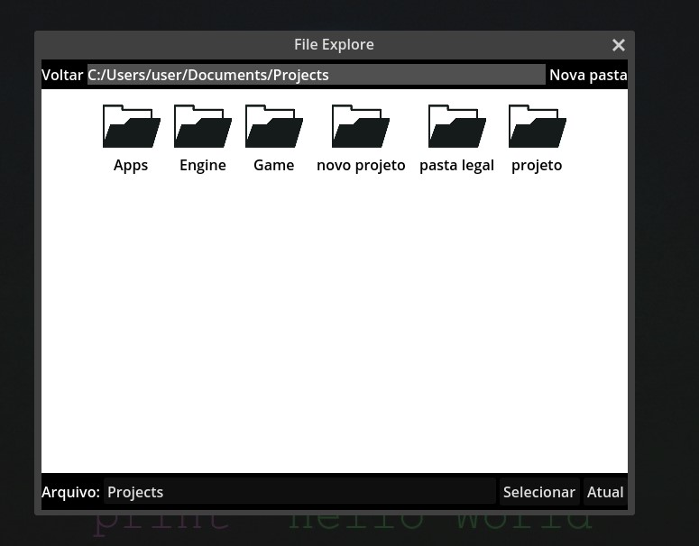
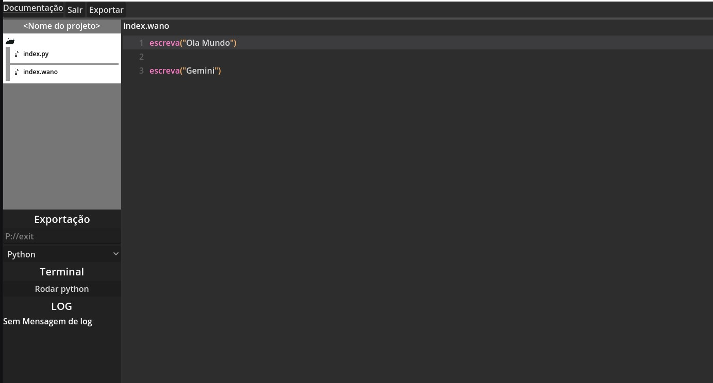
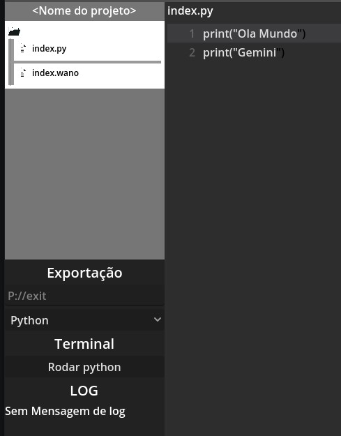

# Poneglyph
Um projeto de código aberto que traduz pseudocódigo em código Python, usando Gemini como motor para a tradução. [Projeto Alura]

### Índices
<a href="#Uso">Modo de uso</a>
<a href="#Sintaxe">Sintaxe de Documentação</a>
<a href="#Estado">Estado do Projeto</a>
## Uso
### Usuário Windows
Possui um exe na pasta exit, um é com console => Quem sabe você não vê um print que eu esqueci no código, e o outro é normal.

[Download Normal](./exit/project.exe)

### Configuração inicial
### Video de Demonstração
Um pequeno video demonstrando, eu usando a ferramenta.

[Demonstração]

Você começa indo em configurações e colando sua chave API e o caminho do projeto

clicando em caminho você abriar uma tela para você selecionar a pasta do seu projeto.

### Abrindo Projeto
Após configurado, certifique-se de que o caminho está ok e que sua API_KEY está correta. Você irá iniciar e cair no hub, ele tem 4 opções em cima:

- Documentação : te redireciona para uma página com a sintaxe
- Sair : fecha o programa
- Exportar : salva e converte o código para .py

Note que acima da área de editar o código está escrito "Sem código", e só clicar no nome do arquivo no lado. Espera, você não tem arquivo?

### Criando pasta e arquivo
Agora criar arquivos e pastas é mais fácil, clique com botão direito na pasta que deseja criar, e você verá 2 opções: criar arquivos e criar pasta.

### Construido o projeto e testando
Depois de escrever o seu código, está na hora de clicar no botão exportar, ele irá gerar um arquivo .py.

 Após abrir ele, você poderá clicar no botão Rodar Python, caso o arquivo aberto não seja Python o programa não irá rodar, e lembre-se de ter o Python 3 na sua máquina.

 

Pronto você pode agora brincar o quanto quiser, escrevendo em português e vendo rodar em outras línguas.   

## Sintaxe
A sintaxe pode ser lida em outra documentação de site -> Bem mais feio

<a href="https://brcrazycraft.github.io/Poneglyph-Doc/index.html">Sintaxe Documentação</a>

## Estado
Lista de funções pensadas e adicionadas:

- [x] Interface para escrever código com marcação
- [x] Leitor e tradutor de pseudocódigo para Python
- [x] Criar um projeto e o salva-lo
- [X] Organizar e refatorar o código
- [ ] Tratamento de erro na API_KEY
- [X] Sistema que salva a chave em documentos
- [X] Melhorar sistema de pasta
- [X] Permitir carregar projetos
- [X] Adicionar um terminal para teste
- [ ] Exportar para outras linguagens
- [ ] Sistema sincronizado de biblioteca com exportação Python
- [ ] Opção de idioma para a pseudo linguagem

## Agradecimentos
- Desenvolvedor Principal: eu
- Desenvolvedor da UI: eu (por isso ficou feia)
- Artista da logo: eu (por isso não tem)
- Desenvolvedor do site: Rick (eu só com apelido)
- Idealizador: Pomme (eu só com meu antigo nick do Discord)

Se não tem dinheiro para fazer, faça você mesmo, mesmo que o código fique um espaguete.

{Tempo de produção 22h}
