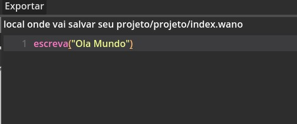

# Poneglyph
Um projeto de código aberto que traduz pseudocódigo em código Python, usando Gemini como motor para a tradução [Projeto Alura].

### Índices
- <a href="#Uso">Modo de uso</a>
- <a href="#Sintaxe">Sintaxe de Documentação</a>
- <a href="#Estado">Estado do Projeto</a>

## Uso
### Usuário Windows
Possui um exe na pasta exit, um é com console => Quem sabe você não vê um print que eu esqueci no código, e o outro é normal.

[Download Normal](./exit/project.exe)

### Configuração inicial
Você começa indo em configurações e colando sua chave API e o caminho do projeto

### Abrindo Projeto
Após configurado, certifique-se de que o caminho está ok e que sua API_KEY está correta. Você irá iniciar e cair no hub, ele tem 4 opções em cima:

- Documentação : te redireciona para uma página com a sintaxe
- Sair : fecha o programa
- Salvar : salva o projeto em .wano com o pseudocódigo
- Exportar : salva e converte o código para .py

Note que acima da área de editar o código está escrito "null.txt" - isso significa que não há nenhum arquivo aberto. Vamos começar a resolver isso.

## Pasta
O projeto ainda não tem pasta, então mesmo que o diretório tenha uma pasta você terá que criar uma nova pasta e só clicar em nova pasta.

De forma intuitiva, é só preencher com o nome da pasta. Se a pasta tiver o mesmo nome de uma pasta já existente na raiz, o projeto é capaz de salvar nela. Após criar uma pasta, você verá que tem um botão chamado config. Nele você pode apagar a pasta (ela vai ser movida para a lixeira do PC) ou criar um novo arquivo.

## Arquivos
Para criar um novo arquivo é bem simples, você preenche com o nome e a linguagem que irá usar (Atualmente só pseudocódigo).

Clicando em criar, surgirá um novo arquivo na pasta.

Com isso é só você dar um clique no nome que o null.txt irá sumir pelo diretório do futuro arquivo.

Com isso você está pronto para escrever código em português e deixar o Gemini se virar para traduzir isso em Python. Depois de clicar em exportar, é só ir no diretório que seu arquivo .py estará lá.

Lembre-se, isso está em desenvolvimento, pode ser que falhe.

## Sintaxe
A sintaxe pode ser lida em outra documentação de site -> Bem mais feio

<a href="https://brcrazycraft.github.io/Poneglyph-Doc/index.html">Sintaxe Documentação</a>

## Estado
Lista de funções pensadas e adicionadas:

- [x] Interface para escrever código com marcação
- [x] Leitor e tradutor de pseudocódigo para Python
- [x] Criar um projeto e o salva-lo
- [ ] Organizar e refatorar o código
- [ ] Tratamento de erro na API_KEY
- [ ] Sistema que salva a chave em documentos
- [ ] Melhorar sistema de pasta
- [ ] Permitir carregar projetos
- [ ] Adicionar um terminal para teste
- [ ] Exportar para outras linguagens
- [ ] Sistema sincronizado de biblioteca com exportação Python
- [ ] Opção de idioma para a pseudo linguagem

## Agradecimentos
- Desenvolvedor Principal: eu
- Desenvolvedor da UI: eu (por isso ficou feia)
- Artista da logo: eu (por isso não tem)
- Desenvolvedor do site: Rick (eu só com apelido)
- Idealizador: Pomme (eu só com meu antigo nick do Discord)

Se não tem dinheiro para fazer, faça você mesmo, mesmo que o código fique um espaguete.

{Tempo de produção 12h}
